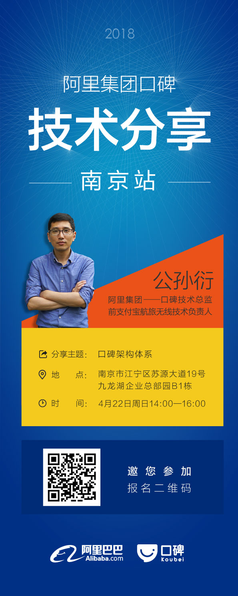

## 阿里集团口碑将于南京举行大型技术分享及专场招聘会

福利来了~~ 福利来了~~ 福利来了~~  重要的事情说三遍~~~~~~

口碑是阿里巴巴集团与蚂蚁金融服务集团深度整合双方优势资源，联手打造的一家互联网本地生活服务平台，于2015年6月23日正式成立。从创立伊始，口碑的使命就是“助力商家，让每个人都享受有口碑的服务”。口碑做为阿里巴巴新零售业态的新生力量，依靠科技重构餐饮产业链，大数据驱动O2O变革，并有志于打造基于支付宝APP、手机淘宝APP和口碑独立APP、业界名厨领衔的餐饮研发中心、国际标准的中央厨房、买手制采购团队、自建+众包物流配送体系和线下体验门店，从而打造“1212全球狂欢节”这一线下狂欢节。

> 口碑将于2018年4月22日周日14:00-16:00，在南京进行专场技术分享，并举行专场招聘会，欢迎业界各位技术大拿参加。以下是报名贴，请扫描二维码进行报名。

>如您有意向加入我们一起共建阿里线下新零售，非常期待您参加专场招聘，帖子里附有JD说明，简历请发送至***wushi@alibaba-inc.com*** ，也可以直接[通过阿里招聘官网渠道投递](https://job.alibaba.com/zhaopin/position_detail.htm?positionId=50274 "Title") 

附：本次招聘的职位有

### 【口碑-Java专家】
#### 岗位描述：
* 1.口碑是阿里巴巴集团与蚂蚁金融服务集团深度整合双方优势资源，联手打造的一家互联网本地生活服务平台，于2015年6月23日正式成立，致力于用开放的心态，以支付为起点、会员为基础、大数据为支撑，吸引优质开发者，共同为本地生活服务商户提供基于生态的、全链路的闭环服务。
* 2.主导或参与到亿级DAU的内容流量平台、日均亿级的交易处理平台和千万级的商户自运营平台规划建设。
* 3.主导或参与到餐饮、快消、丽人、休闲娱乐、亲子教育、婚庆等行业纵深生态规划建设。
#### 岗位要求：
* 1.五年以上大规模分布式系统应用架构设计与研发经验，扎实的Java编程基础，精通Java EE、SOA、OSGI等相关技术；对各种开源的框架如Spring、Hibernate等有深入的了解，对框架本身有过开发或重构者可优先考虑。
* 2.具备良好的识别和设计通用框架及模块的能力，具备系统调优、性能调优等技能，对疑难技术问题具备较强的排查能力。
* 3.对技术有激情，喜欢钻研，能快速接受和掌握新技术，有较强的独立、主动的学习能力，良好的沟通表达能力和团队协作能力。
* 4.专注于技术、对业界的最新技术发展动态有比较密切的关注，同时对电子商务、O2O行业有较深刻的理解和敏感的触觉，能前瞻性提出行业技术解决方案。
* 5.具有大型电子商务网站、O2O行业、C端产品系统架构设计经验背景的优先。
* 6.有带团队经验优先。

### 【口碑-测试专家】

#### 岗位描述：

* 1.跟进口碑线下场景服务端接口和相关后台PC业务测试工作，保证相关功能质量。
* 2.负责相关接口自动化脚本编写和维护，提升服务端接口效率。
* 3.具备较好的开发能力，能够熟练走读开发代码，和开发一起进行代码review。
* 4.协助团队同学提升服务端测试相关技能。

#### 岗位要求：

* 1.有接口测试相关经验或者web产品相关测试经验。
* 2.精通Java，C++或者C中任何一个。
* 3.有测试自动化框架搭建和测试工具开发经验。
* 4.良好的沟通能力和抗压能力。
* 5.对测试技术有较深兴趣。

###【口碑-Android开发专家】

#### 岗位描述：

* 1.独立完成 android客户端程序的开发。
* 2.根据产品需求开发相关的移动产品。
* 3.验证和修正测试中发现的问题。
* 4.配合市场等其他部门，提供产品相关技术支持。

#### 岗位要求：

* 1.三年以上客户端开发经验，精通Android手机平台。
* 2.熟悉掌握至少一种主流手机平台编程语言（C，C++或Java等），有Java相关开发经验不少于2年。
* 3.精通android平台下的高性能编程及性能调优。
* 4.开发基础良好，理解设计模式，在项目或产品中有很好的设计实践。
* 5.有强烈的责任心和团队精神，善于沟通和合作；能独立完成设计和编码。
* 6.对Android的UI控件有实际使用和优化经验者优先；有前端或服务端开发经验者优先。

### 【口碑-IOS开发专家】
#### 岗位描述：
* 1.负责口碑iOS端业务开发。
* 2.iOS应用框架，SDK的开发与维护。
#### 岗位要求：
* 1.三年以上iOS开发经验，熟悉iOS系统常用的framework，对UIKit，CoreAnimation，Quartz2D有优化经验的优先考虑。
* 2.熟悉Objective-C语言，深入理解OC的运行时特性，有C++开发经验的优先考虑。
* 3.熟悉iOS平台常用的开发模式，理解MVC，MVVM并在项目中有所实践。
* 4.熟悉iOS领域里常用的开源库，并知晓其背后的实现原理。
* 5.有强烈的责任心和团队精神，善于沟通合作，能独立完成设计和编码。
* 6.有iOS作品和开源项目者优先。

### 【口碑-H5前端开发专家】
#### 岗位描述：
* 1.负责线下业务H5模块和其他产品前端的架构设计和开发工作。
* 2.负责插件开发，模块化框架设计与开发。
* 3.负责Web App及混合App的前沿技术研究和新技术调研。
#### 岗位要求：
* 1.熟练运用JavaScript语言与HTML5、CSS3等技术，熟悉移动端Web绘图相关高级特性, 如canvas, webGL, CSS3动画效果等。
* 2.熟悉模块化、前端编译和构建工具，熟练运用主流的移动端JS库和开发框架，并深入理解其设计原理，例如：jQuery Mobile、Zepto、Angular、Bootstrap等。
* 3.能提供完善的WebApp和混合App（JS方向）技术方案，了解服务端（node/java或其他语言）或native移动应用开发。
* 4.对技术有强烈的进取心，具有良好的沟通能力和团队合作精神、优秀的分析问题和解决问题的能力。
* 5.有团队管理经验，开源项目开发经验者优先。